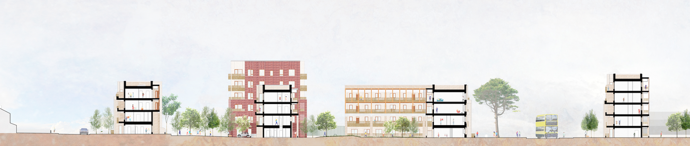

**[Metropolitan Workshop](https://metwork.co.uk/work/)**  
_Senior Architect (Nov 2019 to July 2021)_

I worked as part of a multi-disciplinary design team on a masterplan for 400 homes, a community space and park in North Dublin city. You can [view the public consultation information for Cromcastle Court project online](https://consultation.dublincity.ie/north-central-area/cromcastle-court-and-the-old-coal-yard/). We developed the design and planning application documentation for the first phase of 150 homes to be built using MMC (Modern Methods of Construction).

<figure>
  <figcaption>Proposed section-cut through Cromcastle Court, Dublin</figcaption>
  
</figure>
